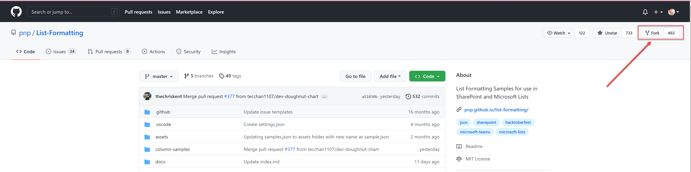
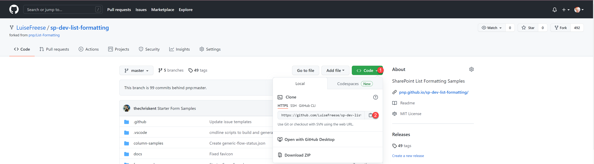
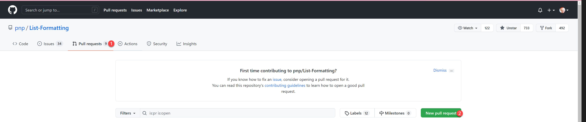
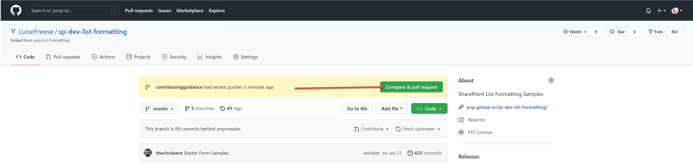
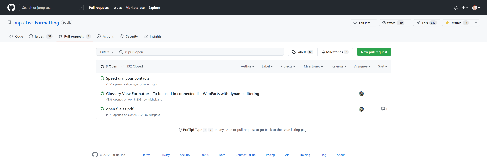
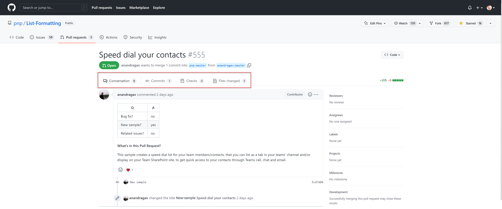
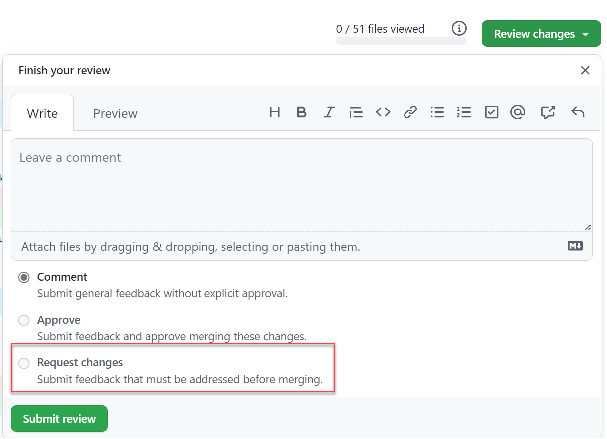
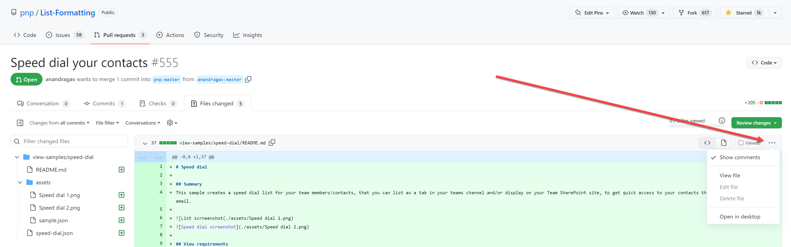
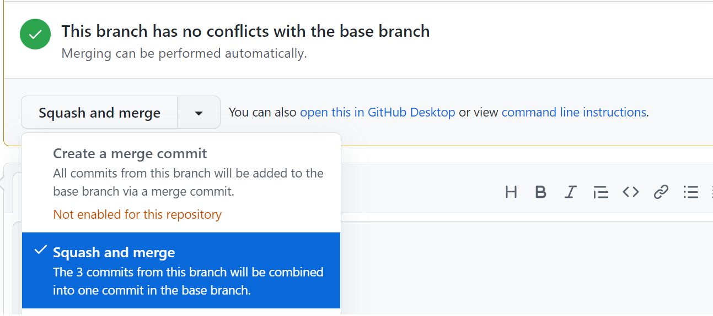

# MaintainerPlaybook

As a maintainer, you take care of the repository and communicate with contributors in Issues and Pull requests. You of course contribute as well. Even though as a maintainer you do have direct write access to the `main`/`master` branch, it is recommended to always work locally on a clone of your fork and then pull request your commits.

## Contributing

### Prerequisites

- Have [VS Code](https://code.visualstudio.com/) installed
- Have [git](https://git-scm.com/) installed

### Fork the repository

Fork the repository to create a copy in your account:

- Open [pnp/sp-dev-list-formatting/](https://github.com/pnp/sp-dev-list-formatting/)
- Select **Fork**

The URL of your fork is now `https://github.com/<YOUR GITHUB ACCOUNT>/sp-dev-list-formatting/`

### Clone the repository

Now you want to clone the repository so you have it locally available:

(1) Select **Code**
(2) Copy the URL (it is `https://github.com/<YOUR GITHUB ACCOUNT>/sp-dev-list-formatting.git`)

- Open the terminal in VS Code
- Navigate to a directory where you want to clone the repository
- Type `git clone <COPIED URL HERE>`

### Branch out

For each sample, we will want to create a new branch and diverge from the main line of development. This way, you can work on something without messing with that main line, which is represented by the **master** branch in this repository. To create a new branch and switch to it, type `git checkout -b <YOUR BRANCH NAME>`

A good branch name tells people what happens in this branch, for example `sample-columnformat-yesNoEmoji` if you are working on a sample for a column format that shall display a yes/no field with emojis.

### Add your files

Now it's time to create a new folder for the sample and add all necessary files to it, typically that is

- column-samples
  - your-sample-folder
    - assets
      - sample.gif
      - sample.json
    - README.md
    - your-sample-format.json
  
Now that you created your sample locally, commit yor changes to your fork.

### Commit your changes

- Open the terminal in VSCode again, make sure that you are in the correct `sp-dev-list-formatting` folder
- Type `git add .` (yes, there is a space (` `) between `add` and the `.`) - this adds all changes to staging area
- Type `git commit -m "YOUR COMMIT MESSAGE"` - this will commit your changes with the message
- Type `git push` to push the changes to your remote fork

### Pull request

You will now want to ask the repository maintainers to pull in your changes. You do that by doing a pull request:

- Open [pnp/sp-dev-list-formatting](https://github.com/pnp/sp-dev-list-formatting)
- Select **Pull requests**
- Select **New pull request**

- Select **compare across forks**
- Select your fork from the **head repository**

- Select **Compare & pull request**

- Fill out the form
  - Give your PR a descriptive title
  - Fill out the markdown table in the body of the PR
  - Describe what's in the PR
- You can always switch to **Preview** to see how it looks like
- Select **Create pull request**
- If needed, you can commit more files and changes

## Maintaining

### Merging pull requests

As a maintainer, if a contributor (or yourself) submitted a pull request, you now need to check if everything looks ok, and if so, merge the changes in their fork into the **master** branch.

- Open [pnp/sp-dev-list-formatting/](https://github.com/pnp/sp-dev-list-formatting/)
- Select **Pull requests** - you should now see a list of open pull requests.

- Select the pull request you want to review
- You can now see the form that the contributor submitted and check the files they committed in the **Files changed** tab. You can also have a detailed look at all commits in the **Commits** tab

- If you want to provide feedback to the contributor, you may add this in the **Conversations** tab, also you can use emoji reactions to show a quick sign of appreciation.
- In case the contributor needs to make changes before you can accept the sample, you can select the **Files changed** tab and then the **Review changes** button, where you can provide feedback.

- In case you want to make the changes on your own, you can select the *...* menu and then select **Edit file** to edit the file online on GitHub.

- Last check if everything looks right
  - Is there a `README.md` file, that describes the sample?
  - Does it refer to a gif that shows the sample in action?
  - Does that gif sit in the `assets` folder?
  - Is there a `sample.json` file in the `assets` folder that describes the sample?
  - Is there a `awesome-new-sample.json` file?
  - Does the sample work as intended?

- If everything looks right, you can select **merge pull request** - which means that you confirm all the changes that the contributor proposed. They will now appear in the **master** branch of the repository. Depending on the settings of the repository it can be that you can either **create a merge commit** or **squash and merge**)

After merging, the Pull request is automatically closed. It's a good idea to thank contributors and show appreciation for their work in the comment of a PR.

### Update your fork

To have your fork up to date with all the good new stuff,

- Open your fork - `https://github.com/<YOUR GITHUB ACCOUNT>/sp-dev-list-formatting/`
- Select **Fetch upstream** and then **Fetch and merge**

### Update your clone

- Open the terminal in VS Code in code, make sure that you are in the correct `sp-dev-list-formatting` folder
- Type `git pull` to pull all changes from your updated fork.
